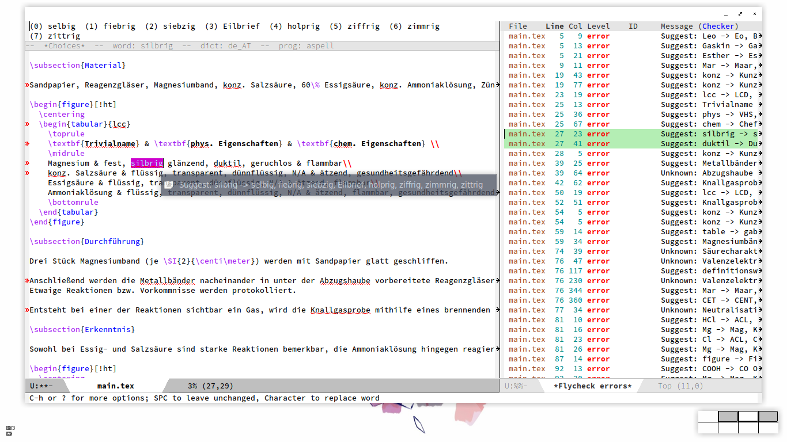

# flycheck-aspell

**NOTE:** This repository now also contains the `flymake-aspell` package, which is what I currently use for spellchecking.
Documentation regarding said package can be found inside the `flymake-aspell.el` file.
Both packages should remain usable for the foreseeable future.

**NOTE:** Both `flycheck-aspell` and `flymake-aspell` now require at least [GNU Aspell 0.60.8](http://aspell.net/man-html/ChangeLog.html) for spell-checking Markdown buffers.
This is because GNU Aspell added a new filter for Markdown syntax but does not support a graceful fallback when filters are not available.



This package adds support for spell checking to Flycheck and Flymake using the [GNU Aspell](http://aspell.net) application.

It is a successor to (and complete rewrite of) my [flycheck-hunspell](https://github.com/leotaku/flycheck-hunspell) project, which was crippled by the bad performance of Hunspell when used with larger files. Aspell performs aproximately 30x faster in the cases I tested.

Aspell also seems to be a bit more flexible than Hunspell with regard to syntax filters, which might prove to be useful in the future.

## Installation

I recommend using [straight.el](https://github.com/raxod502/straight.el) for installing non-(M)ELPA sources.

## Usage

Simply register your preferred checkers with flycheck and then start `flycheck-mode` in the buffer you would like to spell-check.

```emacs-lisp
(require 'flycheck-aspell)
(add-to-list 'flycheck-checkers 'tex-aspell-dynamic)
```

The dictionary the checkers use is determined by the values of `ispell-local-dictionary` or `ispell-dictionary`.

It might be wise to skim the [flycheck docs](https://www.flycheck.org/en/latest/) to learn how to best use and configure flycheck.

You of course also need to install the GNU Aspell binary.

## Configuration

For seamless Ispell integration, I recommend setting the following variables:

```emacs-lisp
(setq ispell-dictionary "some_dictionary")
(setq ispell-program-name "aspell")
(setq ispell-silently-savep t)
```

[This post](https://blog.binchen.org/posts/what-s-the-best-spell-check-set-up-in-emacs.html) might also be of interest.

You may also want to advice `ispell-pdict-save` for instant feedback when inserting new entries into your local dictionary:

```emacs-lisp
(advice-add #'ispell-pdict-save :after #'flycheck-maybe-recheck)
(defun flycheck-maybe-recheck (_)
  (when (bound-and-true-p flycheck-mode)
   (flycheck-buffer))
```

## Features

- [X] initial featureset
- [X] checkers for all filters (all with url support)
  - [X] TeX
  - [X] markdown
  - [X] nroff
  - [X] html
  - [X] texinfo
  - [X] email (message-mode)
- [ ] tests
- [X] honor Ispell localwords (they are marked as info)
